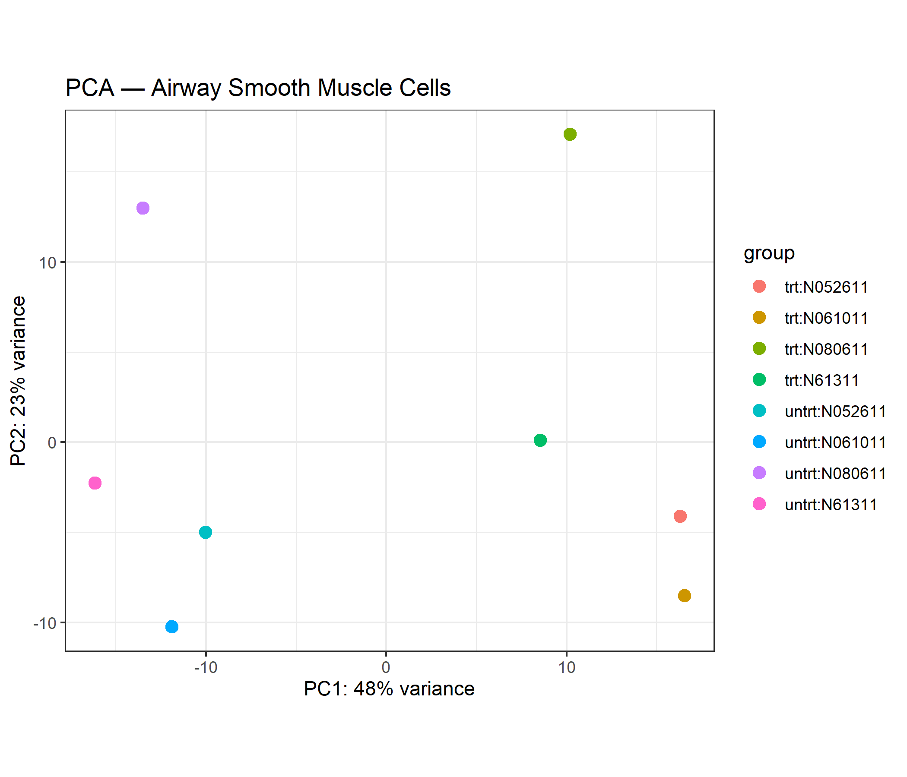
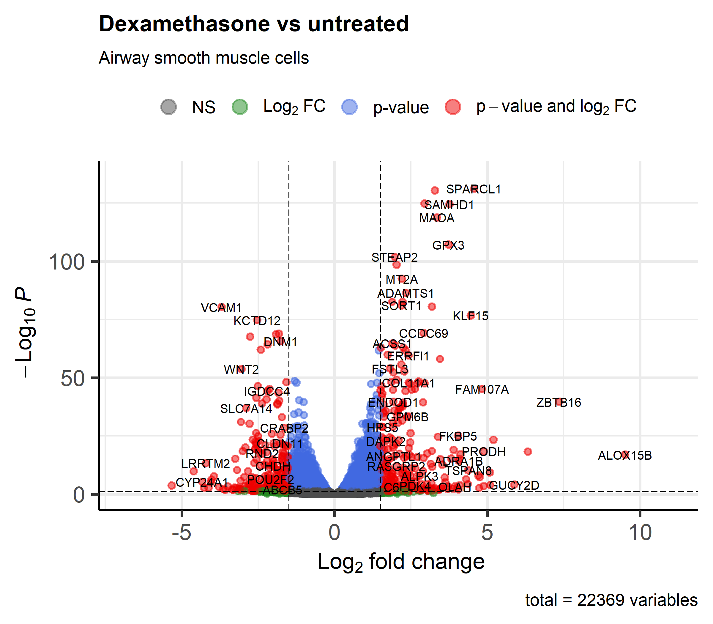
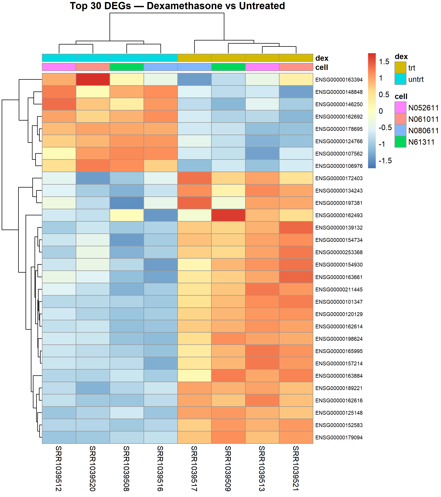
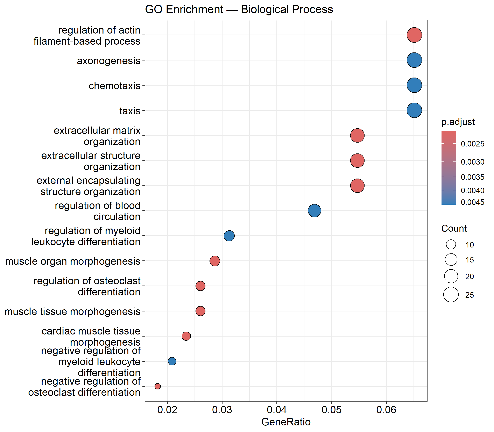
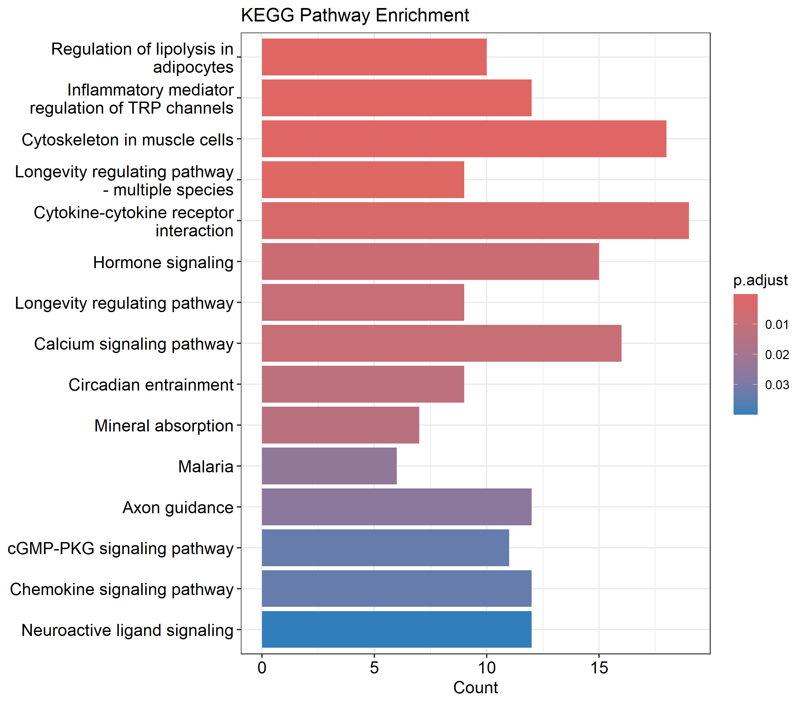

# RNA-Seq Differential Expression Analysis
### Dataset: Airway Smooth Muscle Cells | R & Bioconductor

**Author:** Anuradha Srinivasan  
**GitHub:** [anuradhasrinivasan](https://github.com/anuradhasrinivasan)  
**Tool:** R 4.5.2 | Bioconductor 3.22

---

## Project Overview

This project performs a complete **RNA-Seq Differential Expression Analysis (DEA)** pipeline using the public `airway` dataset from Bioconductor. The dataset contains RNA-Seq read counts from airway smooth muscle cells treated with **dexamethasone** (a corticosteroid) compared to untreated controls.

---

## Dataset

| Feature | Details |
|---|---|
| **Dataset** | `airway` (Bioconductor) |
| **Organism** | *Homo sapiens* |
| **Cell type** | Airway smooth muscle cells |
| **Condition** | Dexamethasone treated vs Untreated |
| **Samples** | 8 samples (4 treated, 4 untreated) |
| **Total genes** | 63,677 |
| **Genes after filtering** | 22,369 |

---

## Pipeline

```
Raw Count Data (airway)
        ↓
DESeq2 Normalization & Filtering
        ↓
Differential Expression Analysis
        ↓
Gene Symbol Mapping (Ensembl → Symbol)
        ↓
Visualization (PCA, Volcano, Heatmap)
        ↓
Functional Enrichment (GO, KEGG)
        ↓
Results Export (CSV)
```

---

## Key Results

| Metric | Value |
|---|---|
| Total genes tested | 22,369 |
| Upregulated (padj < 0.05, LFC > 1.5) | ~2,610 |
| Downregulated (padj < 0.05, LFC < -1.5) | ~2,224 |
| Top upregulated gene | SPARCL1 (LFC = 4.57) |
| Top downregulated gene | VCAM1 |

---

## Visualizations

### PCA Plot
> Samples separate clearly by treatment condition (PC1: 48% variance)



---

### Volcano Plot
> Significant DEGs shown in red (padj < 0.05 & |LFC| > 1.5)



---

### Heatmap — Top 30 DEGs
> Hierarchical clustering shows clear treated vs untreated separation



---

### GO Enrichment — Biological Process
> Top enriched biological processes in significant DEGs



---

### KEGG Pathway Enrichment
> Key pathways affected by dexamethasone treatment



---

## Repository Structure

```
RNA-Seq-Differential-Expression-Analysis/
├── scripts/
│   └── DEA_airway.R          # Complete analysis script
├── results/
│   ├── all_DEG_results.csv   # All 22,369 genes with stats
│   ├── significant_DEGs.csv  # Significant DEGs only
│   ├── PCA_airway.png
│   ├── volcano_airway.png
│   ├── heatmap_top30.png
│   ├── GO_dotplot.png
│   └── KEGG_barplot.png
└── README.md
```

---

## Requirements

```r
# Bioconductor packages
BiocManager::install(c(
  "DESeq2",
  "airway",
  "EnhancedVolcano",
  "clusterProfiler",
  "org.Hs.eg.db"
))

# CRAN packages
install.packages(c("ggplot2", "pheatmap"))
```

---

## How to Run

```r
# Clone the repo and open DEA_airway.R in RStudio
# Run the script from top to bottom
# All results will be saved in the results/ folder
source("scripts/DEA_airway.R")
```

---

## Biological Interpretation

- **SPARCL1, GPX3, MAOA** — strongly upregulated by dexamethasone, linked to anti-inflammatory response
- **VCAM1, WNT2** — downregulated, consistent with suppression of inflammatory signaling
- **GO terms** — enriched for actin cytoskeleton regulation and muscle morphogenesis, expected in airway smooth muscle cells
- **KEGG pathways** — cytokine-cytokine receptor interaction and calcium signaling pathway highly enriched

---

## References

- Himes et al. (2014). *PLoS ONE* — original airway dataset
- Love et al. (2014). DESeq2 — differential expression analysis
- Yu et al. (2012). clusterProfiler — enrichment analysis
